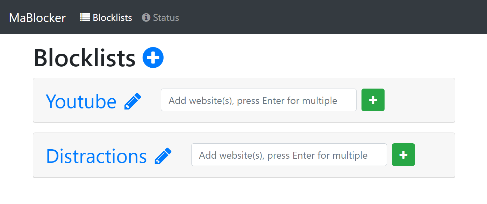

# MaBlocker



Helps you avoid distractions by blocking pages with your router. Provides a convenient web UI & uses SSH to manage DNS entries on any OpenWrt-capable device.

## Running the Application

### Quick Start
1. Install Java 8 or newer
2. Download the latest release from the releases page and unpack it.
3. Run the jar file with `java -jar mablocker.jar`
4. Open your browser: [http://localhost:8880/](http://localhost:8880/)

### Configuring your Router
1. Install OpenWrt on your router
2. Install the `dnsmasq` package (should be running by default)
3. Add the following line to `/etc/dnsmasq.conf`:
```
conf-file=/etc/dnsmasq.blocklist.conf
```
4. Generate a private keypair with [PuttyGen](https://www.chiark.greenend.org.uk/~sgtatham/putty/latest.html).
5. Add the public key part to your router: see [this guide](https://openwrt.org/docs/guide-user/security/dropbear.public-key.auth#from_the_luci_web_interface) for more information.
6. Do this at your own risk: Make your router's SSH port is accessible under a fixed hostname (e.g., DynDNS) or IP address. *I strongly suggest choosing a non-standard port, and making sure that only public-key authentication, and no password authentication, is available.*
7. Edit the `mabloker.properties` file with the appropriate values.
8. Run the application (see above).
9. Create blocklists, add entries to them, and then hit the apply button.
10. (Optional) Set up a reverse proxy (e.g., [Caddy](https://caddyserver.com/)) with HTTPS & HTTP Basic Auth if you want to access the web UI from outside your network.

### Removing Blocklist Entries
This is hidden on purpose: click the pencil to rename a blocklist, then replace "rename" at the end of the URL with "edit". You can then delete entries. Once a blocklist is empty, it can be deleted from the main page. Idea: use reverse proxy rules to further restrict access to the edit page.

## Building
Run ``mvn package`` to build a JAR file with all dependencies included.

## Technology Stack
- Java
- Jersey
- FreeMarker
- Bootstrap
- OpenWrt: SSH & dnsmasq